<picture>
  <source media="(prefers-color-scheme: dark)" srcset="./assets/hero-dark.svg">
  <source media="(prefers-color-scheme: light)" srcset="./assets/hero-light.svg">
  
</picture>

<div align="center">

### Hello, I'm Thuận 👋

Final-year Software Engineering student from Ho Chi Minh City, focused on backend development, cloud computing, and DevOps.

[](https://www.linkedin.com/in/thuận-nguyễn-2266b0361)
[](https://github.com/ngbio)

</div>

## About me

```yaml
name: Nguyễn Thanh Thuận
email: ngthuan2502@gmail.com
location: Ho Chi Minh City, Vietnam
education: Final-year Software Engineering student
interests:
  - Backend and Full-Stack Development
  - Cloud Computing
  - DevOps
currently_learning:
  - Java Spring Boot
  - Docker
  - AWS
```

## Tech stack

<div align="center">


</div>

## GitHub activity

<div align="center">

<picture>
  <source media="(prefers-color-scheme: dark)" srcset="https://github-readme-stats.vercel.app/api?username=ngbio&show_icons=true&hide_border=true&bg_color=070B16&title_color=22D3EE&icon_color=A78BFA&text_color=94A3B8">
  
</picture>
<picture>
  <source media="(prefers-color-scheme: dark)" srcset="https://github-readme-stats.vercel.app/api/top-langs/?username=ngbio&layout=compact&hide_border=true&bg_color=070B16&title_color=22D3EE&text_color=94A3B8">
  
</picture>

<picture>
  <source media="(prefers-color-scheme: dark)" srcset="https://streak-stats.demolab.com?user=ngbio&hide_border=true&background=070B16&stroke=22D3EE&ring=A78BFA&fire=34D399&currStreakLabel=22D3EE&sideLabels=94A3B8&currStreakNum=F8FAFC&sideNums=F8FAFC&dates=64748B">
  
</picture>

<sub>Thanks for stopping by — let's build something useful.</sub>

</div>
